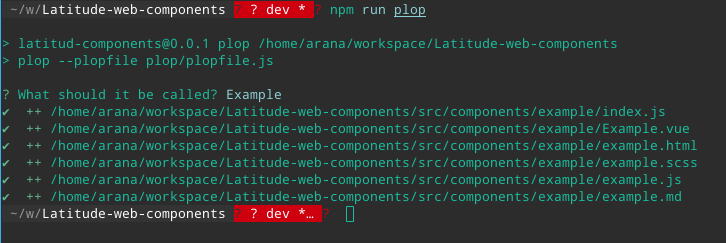
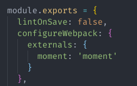

# Latitud Components

Project based in web-components to use in all us project. They are compatible with Angular and Vue projects.

## How use

## Contributing
To contributing you have to read the styleguide and storybook manuel to a good development. Links below.

### Styleguide
Documentation styleguide: [https://vue-styleguidist.github.io/Documenting.html#code-comments](https://vue-styleguidist.github.io/Documenting.html#code-comments)

Documentation JSDoc: [http://usejsdoc.org/](http://usejsdoc.org/)

### Storybook
Documentation: [https://storybook.js.org/docs/basics/introduction/](https://storybook.js.org/docs/basics/introduction/)


Customize configuration: See [Configuration Reference](https://cli.vuejs.org/config/).


## Development

### Project setup
First it is necessary install all dependences.

```
npm install
```

### Compiles and hot-reloads for development with Storybook
The development is based about Storybook library that does a develop server with hot reloads and a global view with all components. Current version 5.


To execute it.

```
npm start
```

## Compiles and minifies for production
To build the library in web components and test them.

```
npm run build
```

The script generate in dist folder a `demo.html` file where you can test all web-components generated.

## Run your tests
Without test currently.

```
npm run test
```

## Lints and fixes files
Script to execute lint checking. The project is configurated to execute the lint in all commit commands.

```
npm run lint
```

## Generate a new component
To generate a new component, we used `plop` like tool.



To execute it.

```
npm run plop
```

When the process finished, generate 5 files in the folder `components/<component_name>`.

```
.
├── example.html
├── example.js
├── example.md
├── example.scss
├── Example.vue
└── index.js
```

* `<component_name>.vue`: File mandatory for link other files. **(No modify)**.
* `index.js`: This file is used to import the component from out.
* `<component_name>.scss`: File to style.
* `<component_name>.hmtl`: File to template.
* `<component_name>.js`: File to write the logic in JS.

To test the new component it's necessary added to `stories/main.js` with `wrap` function to generate a temporal web-component.

```js
const WrappedExample = wrap(Vue, Example)
window.customElements.define('ltd-example', WrappedExample)
```

Later we go to add a new component in storybook or craete a new story if was necessary.

*In the example is created a new story.*

> To call the web-component only add the tag

```js
storiesOf('Example', module)
  .add('Example1', () => ({
    data () {
      return {
        el: undefined
      }
    },
    template: `
    <ltd-example theme='light'>
      <span>Example text</span>
    </ltd-example>
  `,
    mounted () {
      [this.el] = document.getElementsByTagName('ltd-example')
    }
  }))
```

#### Compiles and hot-reloads for development
The styleguide find all components of first level in `components` folder and read all comments in `.js` files and `.md` files. every components.


To execute it.
```
npm run styleguide
```

#### Compiles and minifies for production
To generate the styleguide in static site for production.

To execute it.
```
npm run styleguide:build
```

### Add external dependencies
For development, it is possible use external libraries. For better performance, the external libraries can not be merged in production building, so it is neccesary add them into external webpack config in `vue.config.js` and add them like **dependences** and **peerdependeces** in `package.json`.

